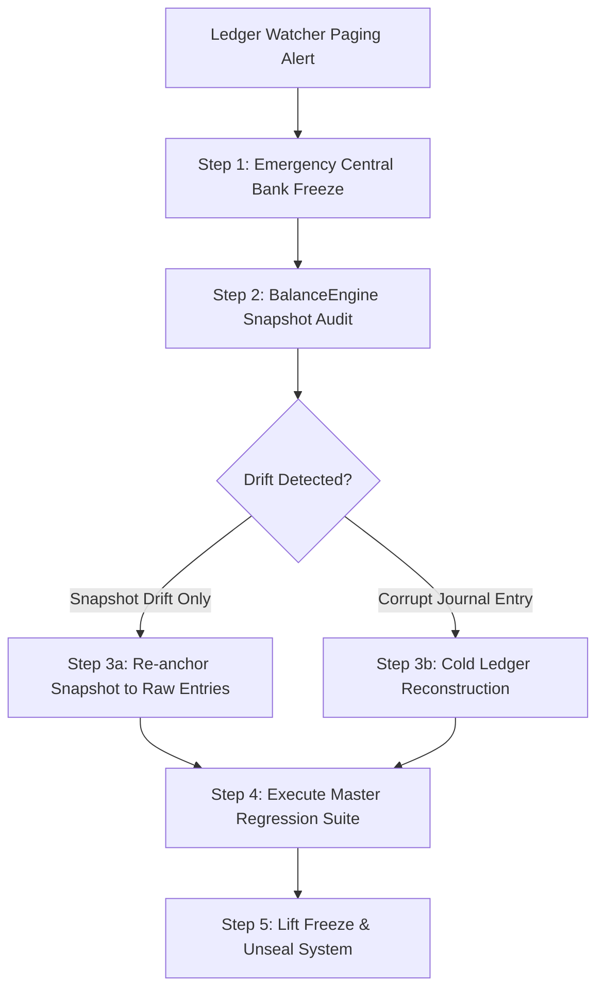

# ARTHAX Sovereign Financial Ecosystem — Disaster Recovery Runbook

**Document Owner**: DevOps & Chief Financial Reliability Engineer  
**Classification**: SOVEREIGN SECRET / OPERATIONAL CRITICAL  
**Status**: ACTIVE & MANDATORY  

---

## 1. Incident Severity & Escalation Hierarchy

| Severity | Definition | Recovery Time Objective (RTO) | Recovery Point Objective (RPO) | Initial Responder |
|:---|:---|:---|:---|:---|
| **P1 — Sovereign Invariant Breach** | $\sum \text{Debits} \ne \sum \text{Credits}$, $M0$ discrepancy, or cryptographic snapshot drift. | **< 15 minutes** | **0 seconds** (Strict Zero Loss) | Chief Architect & Central Bank Governor |
| **P2 — Systemic Settlement Failure** | CLS settlement queue stalled $> 5$ minutes, or inter-bank clearing failure rate $> 5\%$. | **< 30 minutes** | **< 60 seconds** | CLS Operations Lead & DevOps |
| **P3 — Infrastructure Degraded** | Database replica failover, Redis cache evacuation, or single API node termination. | **< 60 minutes** | **0 seconds** | On-Call DevOps Engineer |

---

## 2. Emergency Protocol P1: Sovereign Ledger Imbalance

When the active `LedgerWatcherService` or `/api/v1/health/ledger-integrity` triggers a `CRITICAL_PAGING_ALERT`:



### Step 1: Emergency Central Bank Halt
1. Central Bank Officer executes immediate market and transfer circuit breaker:
   ```bash
   POST /api/v1/central-bank/emergency-actions
   {
     "actionType": "MARKET_HALT",
     "targetEntity": "GLOBAL_MARKET",
     "reason": "Emergency suspension: Investigating cryptographic ledger discrepancy",
     "financialPassword": "<GOVERNOR_FINANCIAL_PASSWORD>"
   }
   ```
2. Set API gateway to maintenance mode:
   ```bash
   docker exec arthax-prod-nginx nginx -s reload
   ```

### Step 2: Run Balance Engine Diagnostic
1. Derive raw entry stream balance against snapshots:
   ```bash
   pnpm --filter @arthax/api exec ts-node -r reflect-metadata src/observability/diagnostic-runner.ts
   ```
2. Verify:
   - Are individual snapshots desynchronized from the append-only `TransactionEntry` stream?
   - Did an unhandled partial write occur?

### Step 3a: Snapshot Re-anchoring (If Raw Stream is Balanced)
1. Execute `reconcileAccount()` on affected ledger accounts:
   ```typescript
   await balanceEngine.reconcileAccount(affectedAccountId);
   ```
2. Snapshots are atomically updated to match $\sum \text{Credits} - \sum \text{Debits}$ of completed transactions.

### Step 3b: Cold Ledger Reconstruction (If Corruption Occurred)
1. Stop all API container writes:
   ```bash
   docker compose -f config/docker/docker-compose.prod.yml stop api
   ```
2. Execute Point-in-Time Recovery to the last verified snapshot prior to the corrupt timestamp:
   ```powershell
   .\config\database\scripts\restore-database.ps1 -DumpFilePath .\backups\arthax_dump_last_known_good.sql
   ```
3. Re-play immutable journal entries verified by the audit log.

### Step 4: Verification & Unsealing
1. Execute full invariant verification matrix:
   ```powershell
   pnpm test:all
   ```
2. Confirm **575+ tests passed, 0 failed**.
3. Lift Central Bank emergency freeze and resume normal operations.

---

## 3. Emergency Protocol P2: CLS Settlement Stalls & Moratoria

When inter-bank settlement transactions are stalled in `PROCESSING` or `SETTLING` $> 5$ minutes:

1. **Inspect Deadlock / Moratorium Status**:
   - Check if any involved commercial bank has been placed under statutory moratorium:
     ```bash
     GET /api/v1/central-bank/emergency-actions?active=true
     ```
2. **Execute Automated Settlement Reconciliation**:
   - Any transaction stalled in `SETTLING` with timeout generates a contra-reversal refund to the source account:
     - `DEBIT sys_cls_clearing`
     - `CREDIT customer_source_account`
3. **Notify Account Holders**:
   - Automated post-commit event dispatches status `REVERSED` notice to citizen mailbox.

---

## 4. Point-in-Time Recovery (PITR) Operational Procedure

### Creating On-Demand Cryptographic Snapshot
```powershell
.\config\database\scripts\backup-database.ps1 -DbName arthax_production -RetentionDays 30
```

### Restoring from Cryptographic Snapshot
```powershell
.\config\database\scripts\restore-database.ps1 -DumpFilePath .\backups\arthax_dump_arthax_production_20260911_120000.sql
```

---

## 5. Security Invariant Post-Mortem Checklist

Every P1 or P2 incident requires a mandatory post-mortem within 24 hours:
- [ ] SHA-256 checksums of database dumps recorded in sovereign incident log.
- [ ] Root cause identified: application defect, network partition, or malicious intrusion attempt.
- [ ] Invariant test case added to `apps/api/src/security/fault-injection.spec.ts` preventing regression.
- [ ] Sign-off by Chief Architect and Central Bank Governor.
